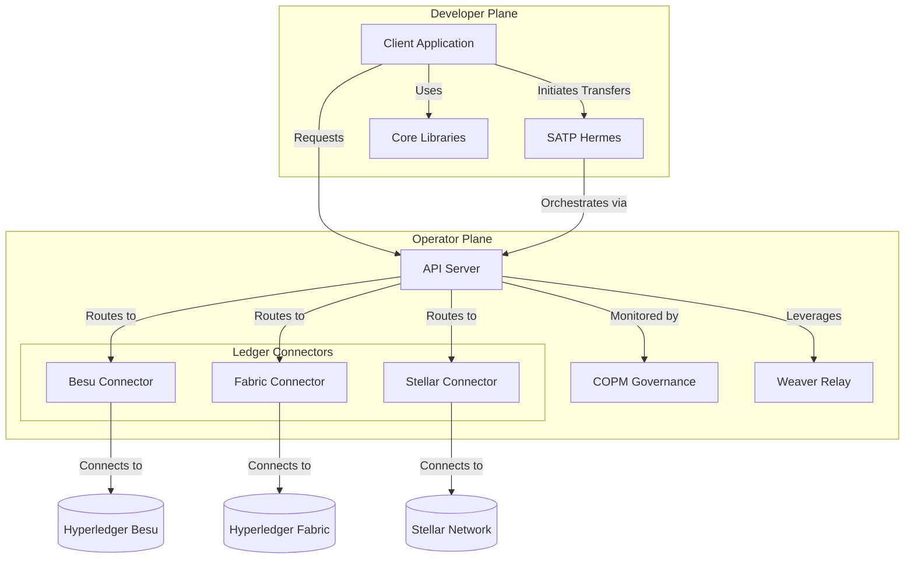

# Cacti Architecture

The Hyperledger Cacti architecture is organized into two primary planes to serve distinct audiences: the **Developer Plane** for those building cross-chain applications, and the **Operator Plane** for those deploying and managing cross-chain infrastructure.

## Component Overview

### Developer Plane (Consuming Cacti)
Developers build applications using Cacti's core utilities and protocols to abstract away the underlying distributed ledger complexity.
* **SATP Hermes:** A robust implementation of the Secure Asset Transfer Protocol, facilitating atomic cross-chain asset transfers.
* **Core Libraries:** Foundational SDK components (`common`, `core`, `core-api`) that provide standardized interfaces and utilities for application development.

### Operator Plane (Deploying Cacti)
Operators provision, configure, and maintain the infrastructure that connects diverse blockchain networks.
* **API Server:** A centralized orchestration engine that manages plugins, authenticates requests, and routes transactions to appropriate ledger connectors.
* **Ledger Connectors:** Standardized bridging modules (e.g., Besu, Fabric, Stellar) that translate Cacti instructions into ledger-specific transactions.
* **COPM:** The Cross-chain Operations and Lifecycle Management subsystem for monitoring and governing cross-chain activity.
* **Weaver:** An advanced interoperability framework providing relay architecture for state proofs and secure data sharing across disjoint networks.

## Architecture Map

The following component map illustrates the logical relationships between the Developer and Operator planes:

## Reference Architecture

The following diagrams illustrate the historical integrated architecture generated by fusing the pre-existing Cactus and Weaver architectures. They are preserved here for reference.

### Integrated Architecture v2

### Legacy Cactus Architecture

### Legacy Weaver Architecture

